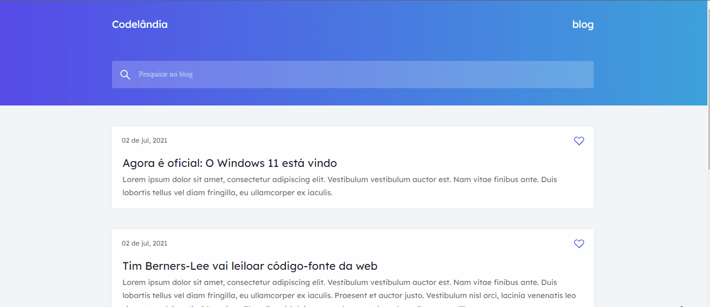
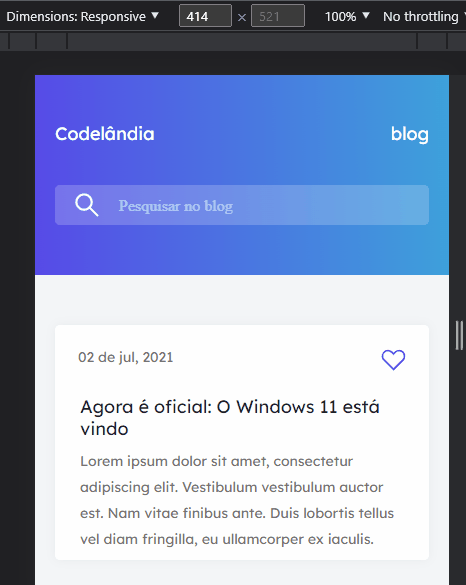

# Codelândia - Desafio 1

<h2> Landing Page - Blog Codelândia </h2>

Desafio criado por <a href="https://github.com/iuricode">Iuri Silva</a>. 
O objetivo dos desafios são em adquirir expênciencias utilizando-se de diversas ferramentas para desenvolvimento Front-End.

[]
[]

## Tecnologias utilizadas

- HTML
- CSS